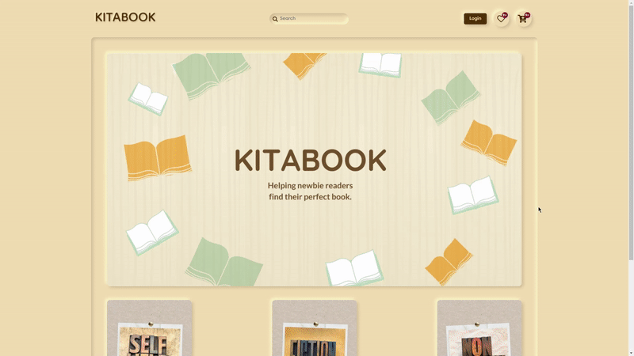

<h1 align="center">
 

 
</h1>

# **📚 KITABOOK**
### KITABOOK | Helping new readers hook up with books
 

<!-- PROJECT SHIELDS -->

  <!--  -->
  
  
  
  
  

# **📃 Pages**

- [Landing Page](https://kitabook.netlify.app/index.html)
- [Login](https://kitabook.netlify.app/pages/auth/login.html)
- [Signup](https://kitabook.netlify.app/pages/auth/signup.html)
- [Product Page](https://kitabook.netlify.app/pages/product-page/product-page.html)
- [Wishlist](https://kitabook.netlify.app/pages/wishlist/wishlist.html)
- [Cart](https://kitabook.netlify.app/pages/cart/cart.html)
- [Filter](https://kitabook.netlify.app/pages/product-page/filter.html)
 

# **🖥 Desktop Version**

# **📱 Mobile Version**

# **⚡ Issue Reporting**

Encountered a bug or do you need a need a feature request ? Please to do check the issues tab on the repo if your issue / request does not exist , [open a new issue](https://github.com/Husain01/Kitabook/issues/new)

**_If you have encountered a bug a before and after picture of the bug would be very helpful or if time permits a small video of the bug would greatly help us undertand the issue._**

# 🔗 Links

